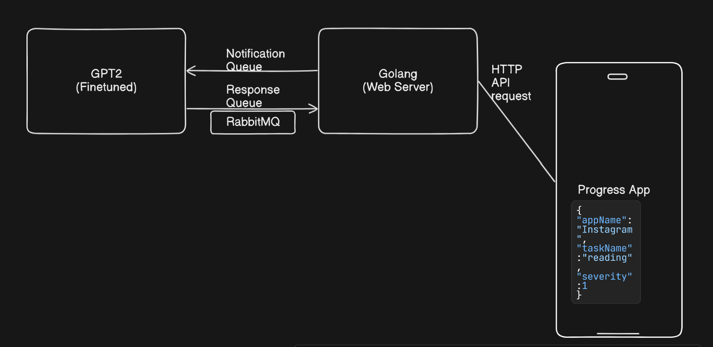

#  Progress
Beat your procastination with the realm of AI which reminds you of the work with satirical notification. 

# Architecture

# Usage
Download the finetuned gpt2 from below
`https://drive.google.com/drive/u/2/folders/1JOhmcHFXLehU1TVhdCPsM56JrwTbBkXq`
After download, move the file to pythonmodel/src/progressgpt2/*
and you are good to go

Install the rabbit mq in docker as
`docker run -it --rm --name rabbitmq -p 5672:5672 -p 15672:15672 rabbitmq:3.13-management`

